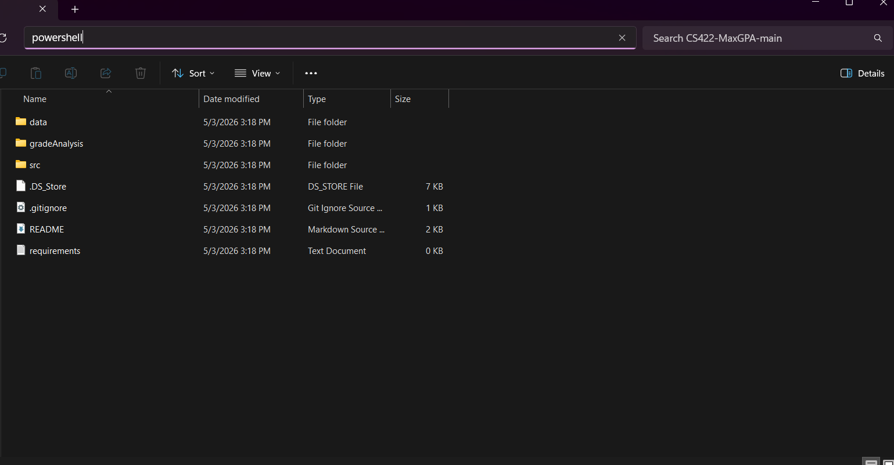

# MaxGPA - University of Oregon Grade Distribution Tool

CS 422 Software Methodologies – Spring 2026  
Team: Adrianna, Joey, Reid, Abby

---

## What is MaxGPA?

MaxGPA is a local web app that helps University of Oregon students view historical grade data for required courses in selected majors.

A student selects:

* a major
* a range of academic years

The app then shows:

* grade distributions for required courses
* instructor comparisons
* the best instructor for each course based on the available grade data

---

## Important: Grade Data Is Not Included

The submitted project does **not** include the University grade-history CSV files.

The administrator must upload the provided cleaned grade CSV after starting the app.

The degree plan CSV files for the supported majors are already included, so the administrator only needs to upload the grade data.

---

## Supported Majors

* Computer Science
* Psychology
* Architecture

---

## Before You Start

You need:

1. The MaxGPA project folder
2. Python installed on your computer
3. The cleaned grade-history CSV file provided for the project

MaxGPA uses the Python package listed in:

```text
requirements.txt
```

The current required package is:

```text
flask
```

The setup steps below install Flask before running the app.

---

# Quick Start

Follow these steps in order.

---

## 1. Download the Project

Download the project ZIP file from GitHub or Canvas.

Right-click the ZIP file and choose **Extract All**.

Choose your **Desktop** as the location.

After it finishes, open the new project folder.

---

## 2. Install Python

Go to:

```text
https://www.python.org/downloads/
```

Download and install Python.

During installation, check the box that says:

```text
Add Python to PATH
```

---

## 3. Open a Terminal in the Project Folder

Inside the project folder, click the address bar at the top of the window.

Copy and paste:

```text
powershell
```

Press **Enter**.



This opens PowerShell in the correct folder so the commands below work.

---

## 4. Create and Activate the Python Environment

Use the commands for your computer.

---

### Windows / PowerShell

Copy and paste this command, then press **Enter**:

```powershell
python -m venv .venv
```

Copy and paste this command, then press **Enter**:

```powershell
.\.venv\Scripts\Activate.ps1
```

If PowerShell blocks the activation command, copy and paste this command, then press **Enter**:

```powershell
Set-ExecutionPolicy -Scope Process -ExecutionPolicy Bypass
```

Then copy and paste the activation command again:

```powershell
.\.venv\Scripts\Activate.ps1
```

---

### Mac / Terminal

Copy and paste this command, then press **Return**:

```bash
python3 -m venv .venv
```

Copy and paste this command, then press **Return**:

```bash
source .venv/bin/activate
```

---

When the environment is active, the terminal line should start with something like:

```text
(.venv)
```

---

## 5. Install Dependencies

Copy and paste this command, then press **Enter** on Windows or **Return** on Mac:

```bash
pip install -r requirements.txt
```

This installs Flask, which is needed to run the MaxGPA website.

---

## 6. Run the App

Use the command for your computer.

---

### Windows / PowerShell

Copy and paste this command, then press **Enter**:

```powershell
python .\src\ui\app.py
```

---

### Mac / Terminal

Copy and paste this command, then press **Return**:

```bash
python3 src/ui/app.py
```

The app should open automatically in your browser.

If it does not open automatically, open your browser and go to:

```text
http://127.0.0.1:5000
```

Do **not** close the terminal window while using the app. The website only works while the app is running.

---

# Administrator: Upload Grade Data

Before student reports can be generated, the administrator must upload the cleaned grade-history CSV.

1. Start the app using the Quick Start steps above.
2. Open the website:

```text
http://127.0.0.1:5000
```

3. Click **Administrator**.
4. In the **Load Grade History Data** section, click **Choose File**.
5. Select the cleaned grade-history CSV file provided for the project. The file does **not** need to already be named `cleaned_pub_rec_master.csv`.
6. Click **Load grade data**.
7. MaxGPA will show a preview row from the CSV.
8. If the preview looks correct, click the confirm/save button.

After confirmation, the app saves the uploaded file internally as:

```text
data/grades/cleaned_pub_rec_master.csv
```

The administrator does **not** need to manually move the CSV into the project folder.

---

# Student: Generate a Report

1. Start the app using the Quick Start steps above.
2. Open the website:

```text
http://127.0.0.1:5000
```

3. Click **Student**.
4. Select a major.
5. Select a start year and end year.
6. Generate the report.

If grade data has not been uploaded yet, MaxGPA will send the user to the Admin page instead of crashing.

---

# Stopping the App

To stop MaxGPA:

1. Go back to the terminal window.
2. Press:

```text
Ctrl + C
```

The website will stop running.

---

# Project Structure

```text
data/
  grades/
    README.md
    .gitkeep
  raw/
    README.md
    .gitkeep
  degree_plans/
    matched/
      computer_science_bs.csv
      psychology_ba.csv
      architecture_barch.csv

gradeAnalysis/
  student.py
  admin.py
  data_loader.py
  main.py

src/
  ui/
    app.py
    templates/
    static/
```

---

# Notes

* University grade-history CSV files are intentionally excluded from this submission.
* The administrator loads grade data through the Admin page.
* Required courses are defined in degree plan CSV files included with the project.
* Flexible requirements such as CoreEd, electives, and choice groups are documented separately.
* Reconciliation files help keep course naming consistent across datasets.
* No login is required.

---

# Troubleshooting

## The report says grade data has not been loaded

This means the grade CSV has not been uploaded yet.

Go to the Admin page:

```text
http://127.0.0.1:5000/admin
```

Then upload the cleaned grade-history CSV.

---

## Python is not recognized

Python may not have been added to PATH during installation.

On Windows, try this command instead:

```powershell
py .\src\ui\app.py
```

If that works, use `py` instead of `python`.

If it still does not work, reinstall Python and make sure **Add Python to PATH** is checked.

---

## Package installation fails

Try this:

```bash
python -m pip install -r requirements.txt
```

On Mac, try:

```bash
python3 -m pip install -r requirements.txt
```


---

## The app does not open automatically

Open your browser and go to:

```text
http://127.0.0.1:5000
```

Make sure the terminal window is still running.

---
